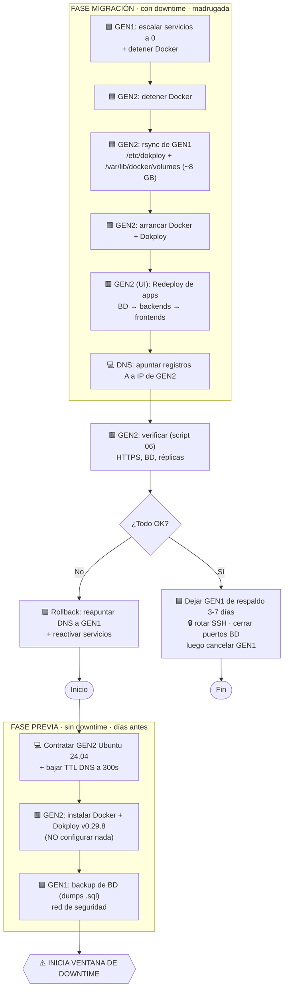

# 📘 Guía completa de migración — Dokploy GEN1 → GEN2

Runbook de inicio a fin: desde instalar Dokploy en el servidor nuevo hasta la verificación final.
Sigue los bloques **en orden**. Cada bloque indica **en qué servidor** ejecutarlo.

## Convenciones (en qué lado ejecutar)
- 🟦 **GEN1** = servidor ORIGEN (`undc@161.132.53.113`) — el actual.
- 🟩 **GEN2** = servidor NUEVO (`undc@<IP_GEN2>`) — el de destino.
- 💻 **PC / Panel DNS** = tu computadora o el panel de tu proveedor de dominios.

> Reemplaza `<IP_GEN2>` por la IP real del servidor nuevo en todos los comandos.

---

## 🗺️ Diagrama del flujo



---

# FASE PREVIA (sin downtime — hazla días antes)

## Paso 0 — 💻 Requisitos
1. Contrata el **GEN2** con **Ubuntu 24.04** (igual que GEN1) y disco ≥ 100 GB.
2. Anota su IP → la llamaremos `<IP_GEN2>`.
3. Confirma que tienes **acceso SSH** a ambos (`undc` con sudo).
4. 💻 **En tu panel DNS:** baja el **TTL a 300 segundos** en todos los registros A de tus dominios.
   (Así, el día D, el cambio de IP propaga en ~5 min en vez de horas.)

## Paso 1 — 🟩 GEN2: instalar Dokploy (versión EXACTA v0.29.8)

> **Por qué la versión exacta:** vamos a restaurar la base de datos de Dokploy de GEN1 (que es v0.29.8).
> Si GEN2 corre una versión más nueva, podría migrar/romper el esquema. Deben coincidir.

```bash
# 🟩 EN GEN2
sudo apt update && sudo apt -y upgrade        # actualizar sistema
sudo timedatectl set-timezone America/Lima    # opcional: misma zona horaria

# Instalar Dokploy (instala Docker, inicia Swarm y despliega el stack)
# El instalador REQUIERE root -> se usa sudo:
curl -sSL https://dokploy.com/install.sh | sudo sh

# Fijar la versión EXACTA de GEN1:
docker service update --image dokploy/dokploy:v0.29.8 dokploy

# Verificar versión y swarm:
docker service inspect dokploy --format '{{.Spec.TaskTemplate.ContainerSpec.Image}}'
docker info --format 'Swarm: {{.Swarm.LocalNodeState}} | Nodes: {{.Swarm.Nodes}}'
```
Entra UNA vez a `http://<IP_GEN2>:3000` para confirmar que carga la pantalla de registro.
**NO crees usuario ni configures nada** — eso se sobrescribe con los datos de GEN1.

> Alternativa con script: sube y ejecuta `02-instalar-dokploy-EN-GEN2.sh`.

## Paso 2 — 🟦 GEN1: backup de bases de datos (red de seguridad)

```bash
# 🟦 EN GEN1  (no detiene nada, sin downtime)
# Sube el script y ejecútalo:
chmod +x ~/01-backup-db-EN-GEN1.sh
./01-backup-db-EN-GEN1.sh
# Genera ~/dumps-migracion.tar.gz  -> cópialo a tu PC por seguridad:
```
```bash
# 💻 EN TU PC
scp undc@161.132.53.113:~/dumps-migracion.tar.gz .
```

---

# FASE MIGRACIÓN (⚠️ con downtime — hazla de madrugada)

## Paso 3 — 🟦 GEN1: detener servicios y Docker

```bash
# 🟦 EN GEN1
# Guardar referencia del estado actual:
docker service ls > ~/servicios-antes-migracion.txt

# Escalar TODOS los servicios a 0 (excepto el stack de Dokploy/Traefik):
docker service ls --format '{{.Name}}' \
  | grep -vE '^(dokploy|dokploy-postgres|dokploy-redis|dokploy-traefik|traefik)$' \
  | xargs -r -I{} docker service scale {}=0

sleep 15

# Detener Docker para copiar en frío (el SSH sigue funcionando):
sudo systemctl stop docker docker.socket
```
> Con script: `./03-detener-EN-GEN1.sh`

## Paso 4 — 🟩 GEN2: transferir los datos desde GEN1

> 🔑 **SSH entre servidores:** el `rsync` se conecta de GEN2 → GEN1. `ssh` te pedirá la contraseña de
> `undc@161.132.53.113` (una vez por copia). Para que NO pregunte, configura antes una clave desde GEN2:
> `ssh-keygen -t ed25519 -N "" -f ~/.ssh/id_ed25519 && ssh-copy-id undc@161.132.53.113`

```bash
# 🟩 EN GEN2
# Detener Docker en GEN2 para recibir datos en frío:
sudo systemctl stop docker docker.socket

# 1) Config de Dokploy (~329 MB): incluye traefik + acme.json (SSL) + bind-mounts
sudo rsync -aHAX --numeric-ids --info=progress2 --delete \
  --exclude='logs/' --exclude='traefik/dynamic/access.log' \
  --rsync-path="sudo rsync" -e "ssh -p 22" \
  undc@161.132.53.113:/etc/dokploy/  /etc/dokploy/

# 2) Volúmenes (~7.5 GB): incluye dokploy-postgres-database y todas las BD
sudo rsync -aHAX --numeric-ids --info=progress2 --exclude='backingFsBlockDev' \
  --rsync-path="sudo rsync" -e "ssh -p 22" \
  undc@161.132.53.113:/var/lib/docker/volumes/  /var/lib/docker/volumes/

# Comprobar datos críticos:
sudo test -f /etc/dokploy/traefik/dynamic/acme.json && echo "OK acme.json" || echo "FALTA acme.json"
sudo test -d /var/lib/docker/volumes/dokploy-postgres-database && echo "OK dokploy-postgres" || echo "FALTA dokploy-postgres"
```
> Con script: `./04-transferir-EN-GEN2.sh`
> Si el rsync se corta por red, vuelve a lanzarlo: reanuda donde quedó.

## Paso 5 — 🟩 GEN2: arrancar Dokploy

```bash
# 🟩 EN GEN2
sudo systemctl start docker
sleep 30
docker service ls | grep -E 'dokploy|traefik'   # el stack debe estar arriba
```
Entra a `http://<IP_GEN2>:3000` → **deberías ver TODOS tus proyectos, apps, dominios y envs**
(vienen de la base `dokploy-postgres-database` restaurada). Inicia sesión con **tus credenciales de siempre**.
> Con script: `./05-arrancar-EN-GEN2.sh`

## Paso 6 — 🟩 GEN2 (UI): Redeploy de cada app

En la interfaz de Dokploy, por cada aplicación/compose pulsa **Redeploy**. Esto recrea el servicio
Swarm en GEN2 apuntando a los volúmenes/bind-mounts ya restaurados (los datos NO se pierden).

> ℹ️ No migramos las imágenes Docker, solo los datos. En el Redeploy, Dokploy **reconstruye** las apps
> desde su código (git) o **descarga** la imagen del registro. Como los envs y credenciales de git/registro
> están en la base restaurada, debería funcionar solo — pero asegúrate de que GEN2 tenga salida a Internet
> y acceso a tus repos/registros privados.

**Orden recomendado:**
1. 🗄️ **Bases de datos** (mysql, postgres, redis) — que estén arriba primero.
2. ⚙️ **Backends / APIs**.
3. 🖥️ **Frontends**.

Las 3 apps que estaban en 0 réplicas (`ciisic-backendciisicvii-y17agg`, `estudiantes-sistramite-di5b2r`,
`rifas-bd-gl65xo`): decide si las reactivas o las dejas apagadas.

## Paso 7 — 💻 DNS: apuntar a la IP nueva

En tu panel DNS, cambia los registros **A** de todos los dominios para que apunten a **`<IP_GEN2>`**.
- Como bajaste el TTL a 300s, propaga en minutos.
- Traefik detecta el tráfico y **re-emite los certificados SSL** automáticamente (Let's Encrypt).
- Verifica con: `https://tudominio.com` (candado válido) o `curl -I https://tudominio.com`.

---

# FASE VERIFICACIÓN Y CIERRE

## Paso 8 — 🟩 GEN2: verificación

```bash
# 🟩 EN GEN2
chmod +x ~/06-verificar-EN-GEN2.sh
./06-verificar-EN-GEN2.sh
```
Checklist:
- [ ] `docker service ls` → réplicas esperadas en `N/N` (compara con `servicios-antes-migracion.txt`).
- [ ] La UI de Dokploy muestra todos los proyectos.
- [ ] Cada dominio responde por **HTTPS** con certificado válido.
- [ ] Conectar a cada **base de datos** y verificar que los datos están.

## Paso 9 — 🟦 Cierre
- [ ] Deja **GEN1 encendido 3-7 días** como respaldo (vence 22/07/2026).
- [ ] Validado todo → **cancela GEN1**.
- [ ] 🔒 **Rota la contraseña SSH de `undc`** (se compartió durante el escaneo).
- [ ] 🔒 Cierra los puertos de BD públicos (3306/3307/3308/13306/5431/5432/6379) con firewall si no los usas remotamente.

---

# 🔙 Plan de rollback (si algo sale mal)
GEN1 queda intacto hasta que lo canceles. Para volver atrás:
```bash
# 🟦 EN GEN1: reactivar servicios
sudo systemctl start docker
sleep 20
# Reescalar a 1 (o el valor original que viste en servicios-antes-migracion.txt):
docker service ls --format '{{.Name}}' \
  | grep -vE '^(dokploy|dokploy-postgres|dokploy-redis|dokploy-traefik|traefik)$' \
  | xargs -r -I{} docker service scale {}=1
```
```text
💻 DNS: vuelve a apuntar los registros A a 161.132.53.113 (GEN1).
```
Si un volumen de BD no levantó en GEN2 → restaura desde los `.sql` de `~/dumps-migracion/` (paso 2).

---

# ⏱️ Tiempos estimados
| Etapa | Duración |
|---|---|
| Instalar Dokploy en GEN2 | 10-15 min |
| Backup de BD en GEN1 | 5-15 min |
| Transferencia rsync (~8 GB) | 10-40 min (según red) |
| Redeploy de 50 apps | 30-90 min |
| Propagación DNS (TTL 300s) | ~5-15 min |
| **Ventana de downtime total** | **2-3 horas** |
