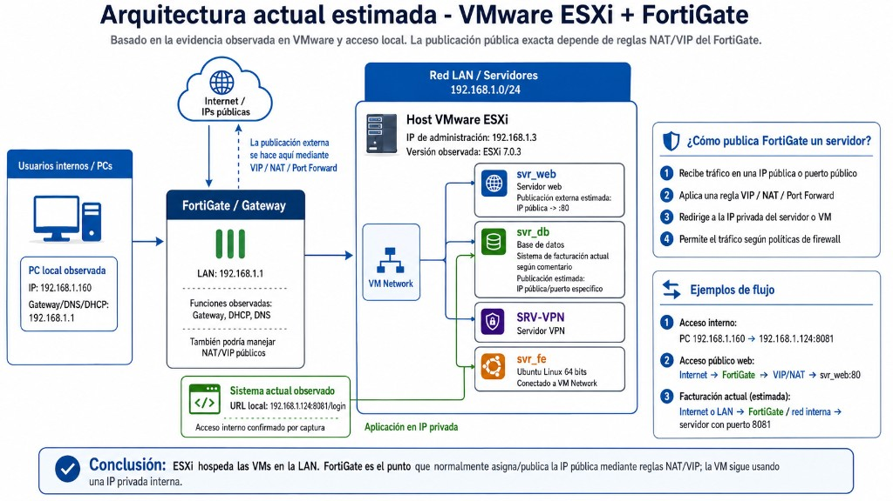
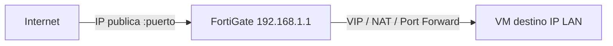
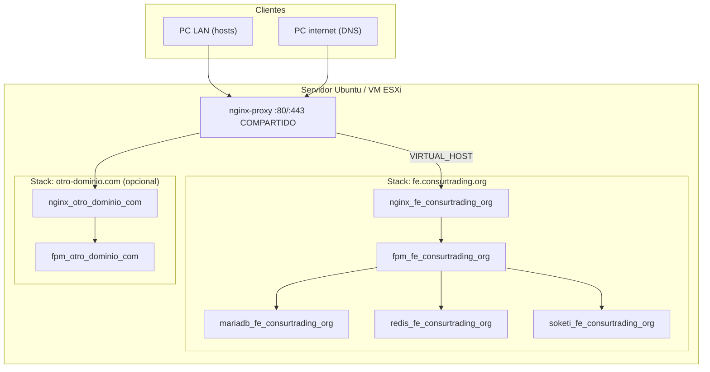
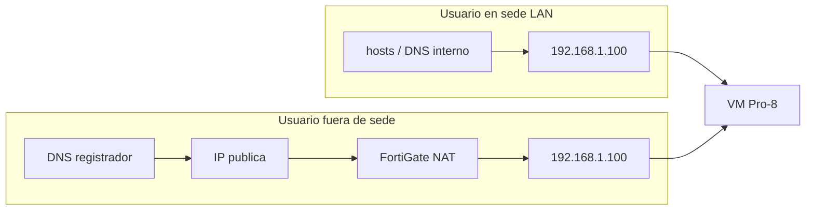

# Arquitectura y contexto — Pro-8 on-premise

> **Documento maestro de referencia.** Conserva todo el contexto del proyecto para
> retomarlo en el futuro (cambio de laptop, nuevo tecnico, meses despues).
> Complementa la guia operativa en [`README.md`](README.md).

---

## Indice

1. [Resumen ejecutivo](#1-resumen-ejecutivo)
2. [Arquitectura del cliente (ESXi + FortiGate)](#2-arquitectura-del-cliente-esxi--fortigate)
3. [Arquitectura de despliegue Pro-8](#3-arquitectura-de-despliegue-pro-8)
4. [Multi-dominio en un mismo servidor](#4-multi-dominio-en-un-mismo-servidor)
5. [Multi-tenant: como resuelve hyn](#5-multi-tenant-como-resuelve-hyn)
6. [APP_URL_BASE vs fqdn vs APP_URL](#6-app_url_base-vs-fqdn-vs-app_url)
7. [Split-horizon (LAN + publico)](#7-split-horizon-lan--publico)
8. [Comparacion con instalacion cloud (nt-suite.pro)](#8-comparacion-con-instalacion-cloud-nt-suitepro)
9. [Bitacora de decisiones](#9-bitacora-de-decisiones)
10. [Mapa de scripts](#10-mapa-de-scripts)
11. [Fases y que ejecutar cuando](#11-fases-y-que-ejecutar-cuando)
12. [Rutas, datos y credenciales](#12-rutas-datos-y-credenciales)

---

## 1. Resumen ejecutivo

### Cliente

**Consurtrading.** Infraestructura on-premise con:

- **VMware ESXi** (host de virtualizacion)
- **FortiGate** (gateway, DHCP, DNS interno, NAT/VIP hacia internet)
- Red LAN `192.168.1.0/24`

### Objetivo

Instalar **Facturador Pro-8** (Laravel + hyn/multi-tenant) en una VM Ubuntu del
ESXi para que funcione:

| Cuando | Como acceden |
|--------|--------------|
| **Hoy (Fase 1)** | Solo LAN: IP del servidor + archivo `hosts` en cada PC, HTTP |
| **Despues (Fase 2)** | Tambien internet: dominio publico + SSL, FortiGate NAT |

### Restriccion que define todo el diseno

Pro-8 identifica cada empresa (tenant) por **subdominio**:

```text
empresa1.fe.consurtrading.org
empresa2.fe.consurtrading.org
```

**No es posible** usar subdominios de una IP:

```text
empresa1.192.168.1.100   ← INVALIDO (no es nombre DNS)
```

Por eso se usa un **dominio real** como base desde el dia 1 y se resuelve:

- **Hoy:** archivo `hosts` en cada PC → IP LAN
- **Manana:** DNS publico → IP publica → FortiGate NAT → IP LAN

Mismo nombre, dos caminos (**split-horizon**). Sin migracion de BD.

---

## 2. Arquitectura del cliente (ESXi + FortiGate)



### Inventario observado

| Componente | IP / dato | Rol |
|------------|-----------|-----|
| Red LAN | `192.168.1.0/24` | Red interna de servidores y PCs |
| FortiGate / Gateway | `192.168.1.1` | Gateway, DHCP, DNS, NAT/VIP |
| Host ESXi | `192.168.1.3` | Hypervisor VMware ESXi 7.0.3 |
| PC ejemplo | `192.168.1.160` | Usuario interno |
| VM `svr_web` | IP privada LAN | Servidor web existente |
| VM `svr_db` | IP privada LAN | Base de datos existente |
| VM `SRV-VPN` | IP privada LAN | VPN |
| VM `svr_fe` | IP privada LAN | Ubuntu 64 bits — **candidata para Pro-8** |
| Sistema facturacion actual | `192.168.1.124:8081` | Sistema legacy observado |

### Flujo de publicacion tipico (cuando FortiGate esta configurado)



Las VMs **siempre** usan IP privada. La IP publica vive en el FortiGate.

### Estado al momento de documentar

- El administrador del FortiGate estaba de **vacaciones**.
- **No hay IP publica** asignada aun para Pro-8.
- Pro-8 debe funcionar **solo en LAN** hasta Fase 2.

---

## 3. Arquitectura de despliegue Pro-8

### Vista general



### Capas

| Capa | Componente | Funcion |
|------|------------|---------|
| Borde | `nginx-proxy` (rash07/nginx-proxy:4.0) | Termina HTTP/HTTPS, lee `VIRTUAL_HOST`, enruta al contenedor nginx correcto |
| App | `nginx_<dom>` | Sirve Laravel desde `/public`, proxy WebSocket `/app` → Soketi |
| Runtime | `fpm_<dom>` | PHP 8.2 + OPcache |
| Datos | `mariadb_<dom>` | BD system + una BD por tenant |
| Cache/colas | `redis_<dom>` | Queues, sesiones |
| Realtime | `soketi_<dom>` | Laravel Broadcasting (Pusher-compatible) |
| Cron | `scheduling_<dom>` | `php artisan schedule:run` cada minuto |
| Workers | `supervisor_<dom>` | `queue:work redis` |

### Red Docker

- **`proxynet`**: red externa compartida. Todos los stacks se conectan a ella.
- El proxy monta `/var/run/docker.sock` para descubrir contenedores y sus
  variables `VIRTUAL_HOST`.

### VIRTUAL_HOST (clave del enrutamiento)

Cada contenedor `nginx_<dom>` declara:

```yaml
environment:
  VIRTUAL_HOST: "fe.consurtrading.org, *.fe.consurtrading.org, 192.168.1.100"
```

Esto permite:

- Panel central por dominio base o por IP directa
- Cualquier tenant `*.fe.consurtrading.org` sin reconfigurar nginx
- Soketi en `ws.fe.consurtrading.org` via su propio `VIRTUAL_HOST`

---

## 4. Multi-dominio en un mismo servidor

El instalador (`install.sh`) es **reutilizable**. Cada ejecucion agrega un
proyecto independiente, cada uno con su propio gestor de tenants. Ejemplo
objetivo para Consurtrading:

```text
fe.consurtrading.org                  ← base proyecto 1 → empresa1.fe..., empresa2.fe...
ntsuite.consurtrading.org             ← base proyecto 2 → empresa1.ntsuite..., empresa2.ntsuite...
```

Cada base lleva su propio cert wildcard (`ssl.sh` por dominio) y su propia
zona DNS local en el FortiGate; el VIP/NAT 80/443 es uno solo.

### Aislamiento por dominio

| Recurso | `fe.consurtrading.org` | `otro-dominio.com` |
|---------|------------------------|---------------------|
| Carpeta | `/opt/proyectos/fe.consurtrading.org/app` | `/opt/proyectos/otro-dominio.com/app` |
| Contenedores | `fpm_fe_consurtrading_org` | `fpm_otro_dominio_com` |
| Volumen MySQL | `fe_consurtrading_org_mysqldata1` | `otro_dominio_com_mysqldata2` |
| Puerto MySQL host | `3001` | `3002` (auto) |
| `.env` APP_URL_BASE | `fe.consurtrading.org` | `otro-dominio.com` |
| Admin | `admin@fe.consurtrading.org` | `admin@otro-dominio.com` |

### Recursos compartidos (una sola vez)

| Recurso | Ubicacion |
|---------|-----------|
| nginx-proxy | `/opt/proyectos/_infra/proxy/` |
| Certificados SSL | `/opt/proyectos/_infra/certs/` |
| Red Docker | `proxynet` |

### Misma IP publica, varios dominios

Cuando el FortiGate haga NAT 80/443 al servidor, **un solo par de puertos**
atiende todos los dominios. El proxy distingue por header `Host`:

```text
Host: fe.consurtrading.org           → stack Consurtrading
Host: empresa1.fe.consurtrading.org → stack Consurtrading (mismo stack, tenant distinto)
Host: otro-dominio.com               → stack otro cliente
```

---

## 5. Multi-tenant: como resuelve hyn

### Tablas clave (BD system)

| Tabla | Contenido |
|-------|-----------|
| `websites` | Cada tenant = un "sitio" con UUID (`tenancy_empresa1`) |
| `hostnames` | Mapeo `fqdn` → `website_id` |
| `clients` | Datos comerciales del cliente (plan, locked, etc.) |

### Creacion de tenant (simplificado)

```text
Input UI:  subdominio = "empresa1"
Config:    APP_URL_BASE = "fe.consurtrading.org"
Calculado: fqdn = "empresa1.fe.consurtrading.org"
           uuid = "tenancy_empresa1"

INSERT hostnames (fqdn = "empresa1.fe.consurtrading.org")
CREATE DATABASE tenancy_empresa1
RUN migrations + seed en BD del tenant
```

Codigo: `pro-8/app/Http/Controllers/System/ClientController.php`

### Resolucion en cada request

```text
1. Request llega con Host: empresa1.fe.consurtrading.org
2. Middleware hyn (auto-identification) consulta hostnames.fqdn
3. Encuentra website_id → cambia conexion DB al tenant
4. routes/web.php evalua:
     if ($hostname) Route::domain($hostname->fqdn)->group(...)
5. Laravel sirve la app del tenant
```

Config: `pro-8/config/tenancy.php` → `auto-identification = true`

### Host central (panel system)

Cuando `Host = fe.consurtrading.org` (sin subdominio de tenant), hyn resuelve
el hostname del sistema y cargan las rutas de administracion (`system.clients`,
`system.dashboard`, etc.) en la parte `else` de `routes/web.php`.

Tambien funciona acceder al panel por IP (`192.168.1.100`) porque `VIRTUAL_HOST`
incluye la IP del servidor.

---

## 6. APP_URL_BASE vs fqdn vs APP_URL

Esta distincion es la mas importante para entender el `.env`.

### Ejemplo cloud (referencia — nt-suite.pro)

```env
APP_URL_BASE=nt-suite.pro
APP_URL=https://${APP_URL_BASE}
FORCE_HTTPS=true
PUSHER_CLIENT_HOST=ws.nt-suite.pro
```

| Variable | Significado |
|----------|-------------|
| `APP_URL_BASE` | Sufijo raiz. Al crear tenant `demo` → fqdn `demo.nt-suite.pro` |
| `APP_URL` | URL del **panel central** (enlaces absolutos, emails system) |
| `demo.nt-suite.pro` | URL del **tenant** (no esta en .env; vive en tabla `hostnames`) |

### Ejemplo on-premise Fase 1

```env
APP_URL_BASE=fe.consurtrading.org
APP_URL=http://${APP_URL_BASE}
FORCE_HTTPS=false
PUSHER_CLIENT_HOST=ws.fe.consurtrading.org
PUSHER_CLIENT_PORT=80
PUSHER_CLIENT_SCHEME=http
```

### Ejemplo on-premise con SSL emitido (tras ssl.sh)

```env
APP_URL=https://${APP_URL_BASE}
FORCE_HTTPS=true
PUSHER_CLIENT_PORT=443
PUSHER_CLIENT_SCHEME=https
```

### Regla de oro

> **`APP_URL_BASE` debe ser el dominio FINAL desde la instalacion.**
> No usar dominios temporales tipo `pro8.local` si despues migraras a
> `fe.consurtrading.org`, porque tendrias que reescribir todos los `fqdn` en BD.

---

## 7. Split-horizon (LAN + publico)

El mismo FQDN se resuelve distinto segun donde este el usuario:



| Escenario | Resolucion de `empresa1.fe.consurtrading.org` |
|-----------|-----------------------------------------------|
| PC interna (Fase 1) | Archivo `hosts` → `192.168.1.100` |
| PC interna (Fase 2) | hosts o DNS FortiGate → LAN (mas rapido) |
| PC externa (Fase 2) | DNS registrador A *.fe → IP publica → NAT |

**La aplicacion no cambia.** Solo cambia la resolucion DNS y (opcionalmente) HTTP→HTTPS.

---

## 8. Comparacion con instalacion cloud (nt-suite.pro)

| Aspecto | Cloud (install/linux) | On-premise (install/onpremise) |
|---------|----------------------|--------------------------------|
| Proxy | nginx-proxy compartido | Igual |
| SSL | certbot DNS-01 en install | certbot DNS-01 cuando se desee (`ssl.sh`; no requiere IP publica) |
| Acceso inicial | Dominio publico | IP LAN + hosts |
| Multi-dominio | Si (SERVICE_NUMBER) | Si (install.sh reutilizable) |
| Contenedores | `fpm_<dom_modificado>` | Igual |
| Motor setup | inline en install.sh | `pro-8/scripts/onprem-setup.sh` |
| Motor update | `update.sh` (linux) | `update.sh` → `onprem-update.sh` |
| Soketi | `ws.<dominio>` | Igual |
| CACHE_DRIVER | `file` (critico) | `file` (critico) |

La arquitectura Docker es **la misma** que produccion cloud; la diferencia es el
**timing del SSL** y el **acceso LAN via hosts** en Fase 1.

---

## 9. Bitacora de decisiones

| # | Tema | Decision | Motivo |
|---|------|----------|--------|
| 1 | Dominio base | `fe.consurtrading.org` | Separado de web oficial y reportes; definitivo desde dia 1 |
| 2 | Tenants | `empresaN.fe.consurtrading.org` | Requerimiento hyn/multi-tenant |
| 3 | Fase 1 acceso | HTTP + IP + hosts | Sin IP publica ni FortiGate disponible |
| 4 | DNS | Registrador directo, **sin Cloudflare** | Wildcard `*.fe.*` requiere plan pago en CF |
| 5 | SSL wildcard | Let's Encrypt DNS-01 **manual** | Un cert para todas las empresas; DNS sin API |
| 6 | Renovacion SSL | Manual cada ~90 dias (`ssl.sh`) | Sin API DNS no hay renovacion automatica |
| 7 | Migracion BD | **No necesaria** | Mismo APP_URL_BASE en ambas fases |
| 8 | Multi-dominio | install.sh reutilizable | Varios clientes en mismo servidor/IP |
| 9 | Puerto MySQL | Auto 3001–3999 por dominio | Evitar colisiones entre stacks |
| 10 | WebSocket | `ws.fe.consurtrading.org` reservado | Soketi + nginx-proxy; incluir en hosts |
| 11 | CACHE_DRIVER | `file` en CLI | Bug conocido redis_tenancy en artisan |
| 12 | route:cache | **NO usar** | hyn evalua rutas por hostname dinamico |
| 13 | Scripts SSL | **Fusionados en `ssl.sh`** (emite o renueva segun detecte) | Requisito original: 3 scripts (install / update / ssl) |
| 14 | SSL en Fase 1 | **Permitido** (DNS-01 no requiere IP publica) | Solo pide TXT en el registrador; mismo cert sirve LAN y publico |
| 15 | Resolucion LAN objetivo | **Zona DNS en FortiGate** (`dns-database`) | Mas rapido, funciona sin internet; hosts por PC = fallback temporal |
| 16 | FortiGate como CA | **Descartado** | Habria que instalar el CA cert en cada PC/dispositivo |
| 17 | Re-ejecucion de install | Reusa secretos del `.env`; nunca `migrate:refresh` sobre BD existente | El volumen MariaDB conserva el password inicial; refresh borra datos |
| 18 | composer.lock | **Se respeta** (sin `rm composer.lock`) | Instalaciones reproducibles en produccion |

---

## 10. Mapa de scripts

### codeplant/facturador-pro/install/onpremise/

```text
install.sh              Bootstrap: Docker, proxy, clone, onprem-setup.sh
update.sh               Selector dominio → onprem-update.sh
ssl.sh                  Selector dominio → EMITE (1ra vez, activa HTTPS) o
                        RENUEVA el wildcard segun detecte cert previo
set-hosts.sh            Helper PC Linux/Mac
set-hosts.ps1           Helper PC Windows
README.md               Guia operativa completa
ARQUITECTURA-Y-CONTEXTO.md   Este documento
configurar-pcs-host.md  Guia detallada de hosts
```

### pro-8/scripts/

```text
onprem-setup.sh         Motor: genera stack, .env, migrate, seed, credenciales
onprem-update.sh        Motor: backup, pull, composer, migrate, recache
list-tenant-hosts.sh    Lee hostnames → imprime lineas para /etc/hosts
local-setup.sh          Desarrollo local (WSL) — NO usar en on-premise prod
prod-update.sh          Produccion generica — preferir onprem-update.sh
```

### Flujo de invocacion

```text
install.sh
  └─► git clone pro-8
        └─► scripts/onprem-setup.sh

update.sh
  └─► scripts/onprem-update.sh  (en proyecto elegido)

ssl.sh
  ├─► SIN cert previo  → certbot DNS-01 → edita .env a HTTPS → restart proxy
  └─► CON cert previo  → certbot --force-renewal → copia certs/ → restart proxy
```

---

## 11. Fases y que ejecutar cuando

### Fase 1 — LAN (instalar y operar sin internet publico)

```bash
# En la VM del servidor
cd /opt/proyectos
sudo ./install.sh
# Responder: dominio, IP, rama

# En cada PC interna
sudo ./set-hosts.sh <IP> <dominio> [empresa1 empresa2 ...]

# Crear empresas desde el panel
http://<IP>/login  →  Clientes → Nuevo

# Al crear empresa nueva, actualizar hosts en PCs:
cd /opt/proyectos/<dominio>/app
bash scripts/list-tenant-hosts.sh
```

### SSL — en cualquier momento (NO requiere IP publica)

```bash
# Solo necesita crear un TXT _acme-challenge en el DNS del registrador.
# Emite el wildcard y activa HTTPS; si ya hay cert, lo renueva.
cd /opt/proyectos
sudo ./ssl.sh --domain fe.consurtrading.org
```

### Fase 2 — Publico (checklist del admin de red FortiGate)

El detalle por dominio queda generado en `/opt/proyectos/<dominio>/<dominio>-onprem.txt`
(seccion "PENDIENTES ADMIN DE RED"). Resumen:

```text
# 1. DNS registrador (manual en panel del proveedor) — POR dominio base
A   fe.consurtrading.org     → IP_PUBLICA
A   *.fe.consurtrading.org   → IP_PUBLICA

# 2. FortiGate VIP/NAT (UNA vez, compartido por todos los dominios)
VIP/NAT :80  → 192.168.1.100:80
VIP/NAT :443 → 192.168.1.100:443

# 3. FortiGate DNS local (POR dominio base; reemplaza hosts de las PCs)
config system dns-database → zona fe.consurtrading.org:
  @  A 192.168.1.100   |   *  A 192.168.1.100   |   ws  A 192.168.1.100
DHCP de la LAN entrega el FortiGate como DNS.

# 4. Si el SSL no se emitio antes: sudo ./ssl.sh --domain fe.consurtrading.org
# 5. Retirar entradas pro-8 del hosts de las PCs
```

### Mantenimiento continuo

```bash
# Actualizar codigo (elegir dominio + rama)
sudo ./update.sh

# Renovar SSL (~90 dias; mismo script, detecta el cert existente)
sudo ./ssl.sh --domain fe.consurtrading.org

# Listar lineas hosts actualizadas
bash /opt/proyectos/fe.consurtrading.org/app/scripts/list-tenant-hosts.sh
```

---

## 12. Rutas, datos y credenciales

### Ubicaciones tipicas

| Que | Donde |
|-----|-------|
| Raiz instalacion | `/opt/proyectos/` |
| Proyecto Consurtrading | `/opt/proyectos/fe.consurtrading.org/app/` |
| Credenciales | `/opt/proyectos/fe.consurtrading.org/fe.consurtrading.org-onprem.txt` |
| Proxy compartido | `/opt/proyectos/_infra/proxy/` |
| Certificados SSL | `/opt/proyectos/_infra/certs/` |
| Backups pre-update | `storage/app/backups/pre-update/FECHA/` |

### Archivos criticos por proyecto

```text
.env                    Variables Laravel + Docker
docker-compose.yml      Definicion de servicios
supervisor.conf         Workers de cola
storage/                Uploads, logs, backups
docker/nginx/default    Config nginx + proxy Soketi
```

### Datos persistentes (NUNCA borrar en produccion)

```bash
docker volume ls | grep -E 'mysqldata|redisdata'
```

### Comandos peligrosos

```bash
# PROHIBIDO en produccion:
docker compose down -v
docker volume rm <mysqldata>
docker system prune --volumes
```

> Para **eliminar** un dominio a proposito usa `sudo ./uninstall.sh --domain
> <dominio>` (borra contenedores + volumenes + carpeta de forma ordenada).
> Borrarlo a mano deja volumenes huerfanos y luego el `Access denied` al
> reinstalar el mismo dominio.

---

## Historial de contexto

| Fecha | Evento |
|-------|--------|
| 2026-06 | Cliente Consurtrading; ESXi + FortiGate; admin FortiGate de vacaciones |
| 2026-06 | Dominio facturacion: `fe.consurtrading.org` (separado de web y reportes) |
| 2026-06 | Sin Cloudflare; DNS registrador sin API; SSL manual DNS-01 |
| 2026-06 | Scripts on-premise multi-dominio en `codeplant/.../onpremise/` |
| 2026-06-12 | Revision: SSL fusionado en `ssl.sh` (emite/renueva); SSL emisible desde Fase 1 (DNS-01 sin IP publica); re-ejecucion de install reusa secretos (sin `migrate:refresh` sobre BD existente); se respeta `composer.lock`; checklist "PENDIENTES ADMIN DE RED" generado por dominio en `<dominio>-onprem.txt` (DNS registrador, VIP/NAT, zona DNS FortiGate); segundo dominio planificado `ntsuite.consurtrading.org` |
| 2026-06-18 | Reorganizacion del instalador: layout `_infra/{proxy,certs}` + `<dominio>/app` (repo) + credenciales dentro de la carpeta del dominio; `install.sh` ancla la raiz a su ubicacion (fin del anidamiento `<dominio>/<dominio>`) y hace preflight de Docker primero; `COMPOSE_PROJECT_NAME` fija nombres de volumen deterministas; nuevo `uninstall.sh` y guarda anti-huerfanos que resuelven el `Access denied for user 'root'` al reinstalar un dominio borrado a mano |
